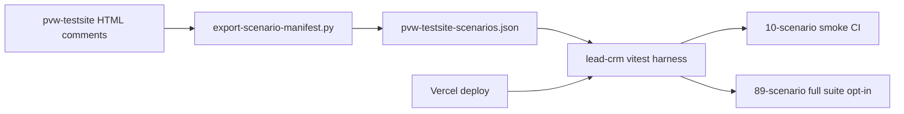

# Testsite Expansion 4 — Validation, Harness, and Smoke CI

**Date:** 2026-06-23  
**Status:** Implemented

## Scope

Expansion 4 is a validation-and-hardening pass — not a large page expansion. It ships the lead-crm regression harness, runs live audits against deployed pvw-testsite, fixes manifest/HTML drift, closes the last two observation-code gaps, enriches outreach expectations, and adds a 10-scenario CI smoke gate.

## Architecture

### Smoke vs full regression

| Command | When | Scenarios |
|---------|------|-----------|
| `npm run test:pvw-smoke` | CI on every PR + weekly schedule | 10 risk-class anchors |
| `PVW_TESTSITE_AUDIT=1 npm run test:pvw-full` | Pre-release manual | All 89 scenarios |

Smoke fixture paths: `clean`, `no-title`, `blank-above-fold`, `script-errors`, `render-incomplete`, `no-call-path`, `no-email-finding`, `form-validation-broken`, `trust-signal-gap`, `towing`.

### Assertion rules

- **Findings:** exact match
- **Observations:** subset (expected codes must appear; extras allowed)

## New scenarios (89 total)

| Page | Code isolated |
|------|----------------|
| `observations/critical-asset-failure.html` | `critical_asset_failure` |
| `observations/required-field-overload.html` | `required_field_overload` |

## Drift reconciliation

`scripts/reconcile-audit-report.py` shells to `lead-crm/scripts/reconcile-pvw-testsite.ts` and writes `scripts/reconcile-report.csv` for triage.

## Intentional exclusions

- Infrastructure findings: `dead_site`, `no_https`, `slow_load` (finding), `http_redirect`
- Legacy `legacy/pending-engine/` pages (6) until engine codes land
- Full 89-scenario CI (smoke subset only)

## Verification checklist

- [ ] `npm run test:pvw-smoke` passes in lead-crm CI against deployed pvw-testsite
- [ ] `PVW_TESTSITE_AUDIT=1` full suite passes locally (89 scenarios)
- [ ] Registry count = filesystem count = manifest count (89)
- [ ] All outreach pages have non-empty expected codes in manifest
- [ ] `clean.html` returns zero findings on live audit
